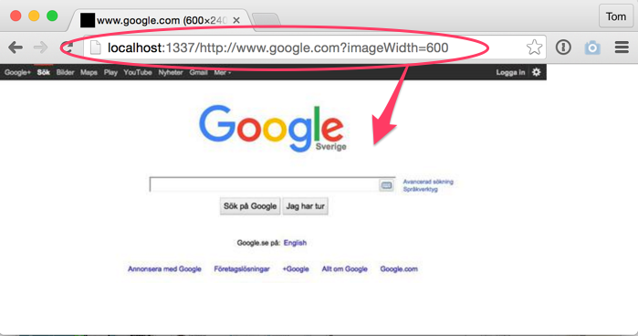

# Screenshooter v3 (serverless)

Generates a screenshot of any web page - as API or command line. Powered by [Puppeteer](https://github.com/GoogleChrome/puppeteer).

Initally made by the team at **Weld** ([www.weld.io](https://www.weld.io?utm_source=github-screenshooter)), the code-free app and web creation tool:

## Screenshot

## How to run it

1. Install dependencies: `yarn`
2. Start Screenshooter with `yarn dev`

## How to use it

Browser: Open your favorite browser and take a screenshot like this: `http://localhost:3337/?url=https://www.google.com`

Embed a screenshot directly into an HTML `img` tag:

	

### Parameters

E.g. `http://localhost:3337/?url=https://www.google.com?imageFormat=png`

* `url` (required)
* `format`: `jpeg` (default) or `png`
* `width`: default 800
* `height`: default 450
* `dpr`: deviceScaleFactor, default is 1.0. Note you can use this as a zoom factor; the browser canvas has the same size, but the output image has different size.
* `time`: milliseconds or `networkidle0`

Extra options for `/image` (and `/imagePage`):

* `backgroundColor`: default 'black'
* `fit`: default 'cover', 
* `position`: default 'center'

## All routes:

* `http://localhost:3337/?url=` (`/api/webpageScreenshot.js`)
* `http://localhost:3337/image?url=` (`/api/imageScreenshot.js`)
* `http://localhost:3337/imagePage?url=` (`/api/imagePage.js`) – Renders a HTML page that is used by `/image` route.

## Command line (not currently supported)

	node api/webpageScreenshot.js http://www.google.com myimage.jpg imageWidth=500 imageHeight=400
